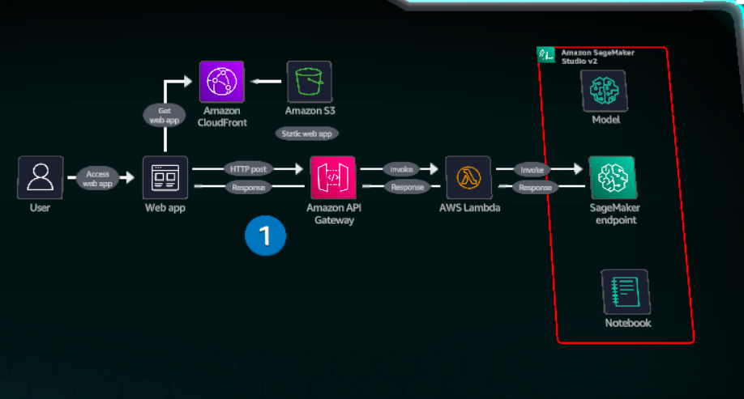

# SageMaker Falcon-7B Endpoint Testing Project

A complete solution for deploying and testing a Falcon-7B Instruct model on Amazon SageMaker, including both a Jupyter notebook for development and a production-ready web interface for testing.

## Project Overview

This project provides a comprehensive demonstration of deploying and testing a Hugging Face Falcon-7B Instruct model using Amazon SageMaker's JumpStart service. It includes:

- **Jupyter Notebook**: Step-by-step deployment and testing guide
- **Web Testing Interface**: Production-ready HTML interface for model testing
- **Architecture Documentation**: Complete AWS architecture for production deployment

The Falcon model is a state-of-the-art generative AI model trained on the RefinedWeb dataset, capable of performing various natural language processing tasks including code generation, translation, question answering, and more.

## Architecture

The following diagram illustrates how this SageMaker endpoint can be integrated into a production web application:



### Architecture Components

- **Web Application**: Frontend interface for user interaction
- **Amazon CloudFront & S3**: Content delivery network for static web assets
- **Amazon API Gateway**: RESTful API management and routing
- **AWS Lambda**: Serverless compute for handling inference requests
- **Amazon SageMaker Endpoint**: Hosted ML model for text generation
- **SageMaker Studio v2**: Development environment for model management

## Project Components

### 📓 Jupyter Notebook (`sagemarker-endpoint.ipynb`)
Complete development environment for:
- **Model Deployment**: Deploy Falcon-7B Instruct model using SageMaker JumpStart
- **Instance Configuration**: Set up with ml.g5.2xlarge instance type
- **Endpoint Testing**: Comprehensive testing with various prompts
- **Parameter Tuning**: Experiment with different inference parameters

### 🌐 Web Testing Interface (`index.html`)
Production-ready web application featuring:
- **Modern UI**: Responsive design with AWS-inspired styling
- **Real-time Testing**: Interactive interface for model testing
- **Preset Examples**: Quick access to common use cases
- **Parameter Controls**: Adjustable temperature, max tokens, and top-p
- **Connection Testing**: Built-in endpoint connectivity verification
- **Error Handling**: Comprehensive error management and user feedback

### 🏗️ Architecture Documentation
Complete AWS architecture including:
- **Static Website Hosting**: S3 + CloudFront for web interface
- **API Gateway**: RESTful API management
- **Lambda Functions**: Serverless compute for inference handling
- **SageMaker Integration**: Seamless model endpoint integration

## Text Generation Capabilities

The project demonstrates various NLP tasks:

- **💻 Code Generation**: Generate Python code for programming tasks
- **🌍 Translation**: Translate text between different languages
- **😊 Sentiment Analysis**: Analyze sentiment of text inputs
- **❓ Question Answering**: Answer questions based on knowledge
- **🍰 Recipe Generation**: Create detailed cooking recipes
- **📝 Text Summarization**: Summarize long articles and documents
- **✍️ Sentence Completion**: Complete partial sentences and paragraphs

## Inference Parameters

Both the notebook and web interface support:
- `max_new_tokens`: Control output length (1-2048)
- `temperature`: Adjust randomness in generation (0.1-2.0)
- `top_p`: Nucleus sampling parameter (0.1-1.0)
- `do_sample`: Enable/disable sampling
- `no_repeat_ngram_size`: Prevent repetitive text
- `stop`: Define stop sequences

## Model Information

### Falcon-7B Instruct
- **Parameters**: 7 billion
- **Training Data**: 1.5 trillion tokens from RefinedWeb dataset
- **License**: Apache 2.0
- **Architecture**: Causal decoder-only with FlashAttention
- **Optimization**: Inference-optimized with multiquery attention

### Key Features
- Permissively licensed open-source model
- Trained on high-quality, deduplicated web data
- Optimized for inference performance
- Ready-to-use for chat and instruction tasks

## Getting Started

### Prerequisites
- AWS Account with SageMaker access
- SageMaker Studio or Jupyter environment
- Appropriate IAM permissions for SageMaker operations
- Basic knowledge of AWS services (S3, API Gateway, Lambda)

### Quick Start

#### Option 1: Jupyter Notebook Development
1. Open `sagemarker-endpoint.ipynb` in SageMaker Studio
2. Run cells sequentially to:
   - Deploy the Falcon-7B model
   - Test various text generation scenarios
   - Experiment with different inference parameters
3. Clean up resources when finished

#### Option 2: Web Interface Testing
1. Deploy the model using the notebook
2. Set up API Gateway endpoint (see Architecture section)
3. Upload `index.html` to S3 bucket
4. Enable static website hosting
5. Access the web interface and test the model

### Deployment Options

#### Development Environment
- Use the Jupyter notebook for development and testing
- Direct SageMaker endpoint access
- Interactive parameter tuning

#### Production Environment
- Deploy web interface to S3 + CloudFront
- Use API Gateway + Lambda for endpoint access
- Implement proper authentication and monitoring

### Cost Considerations
- **SageMaker Endpoint**: Uses `ml.g5.2xlarge` instance type (~$1.21/hour)
- **S3 Storage**: Minimal cost for static website hosting
- **API Gateway**: Pay per request (first 1M requests free)
- **Lambda**: Pay per invocation (first 1M requests free)
- **Best Practice**: Deploy only when needed and clean up after testing

## Use Cases

This project is ideal for:

### 🎓 Learning & Education
- **Students** understanding generative AI concepts
- **Developers** learning SageMaker model deployment
- **Data Scientists** experimenting with large language models
- **ML Engineers** building text generation applications

### 🏢 Business Applications
- **Content Generation**: Automated content creation for blogs, social media
- **Customer Support**: AI-powered chatbots and support systems
- **Code Assistance**: Developer tools for code generation and completion
- **Language Services**: Translation and language processing applications

### 🔬 Research & Development
- **Model Evaluation**: Testing and benchmarking LLM performance
- **Prompt Engineering**: Experimenting with different prompting strategies
- **Parameter Tuning**: Optimizing model parameters for specific tasks
- **Architecture Testing**: Validating AWS serverless ML architectures

## Project Structure

```
testing-sagemarker-endpoint/
├── README.md                    # Project documentation
├── sagemarker-endpoint.ipynb   # Jupyter notebook for development
├── index.html                   # Web testing interface
└── architecture-diagram.png    # AWS architecture diagram
```

## Limitations

- **Language**: Model primarily trained on English data
- **Bias**: May contain biases present in training data
- **Production**: Requires appropriate guardrails for production use
- **Fine-tuning**: Should be fine-tuned for specific domain tasks
- **Cost**: Real-time inference can be expensive for high-volume usage

## Next Steps

### Immediate Actions
1. **Deploy the Model**: Use the notebook to deploy your SageMaker endpoint
2. **Test the Interface**: Upload `index.html` to S3 and test the web interface
3. **Set up API Gateway**: Create the serverless architecture for production use

### Advanced Development
- **Fine-tuning**: Customize the model for specific use cases
- **Monitoring**: Implement CloudWatch monitoring and alerting
- **Security**: Add authentication and input validation
- **Scaling**: Implement auto-scaling for high-volume usage
- **CI/CD**: Set up automated deployment pipelines

### Production Considerations
- **Error Handling**: Implement comprehensive error management
- **Rate Limiting**: Add request throttling and rate limiting
- **Caching**: Implement response caching for common queries
- **Logging**: Add detailed logging and analytics
- **Backup**: Implement model versioning and rollback capabilities

## Resources

### AWS Services
- [Amazon SageMaker Documentation](https://docs.aws.amazon.com/sagemaker/)
- [SageMaker JumpStart Models](https://sagemaker.readthedocs.io/en/stable/overview.html#use-prebuilt-models-with-sagemaker-jumpstart)
- [API Gateway Documentation](https://docs.aws.amazon.com/apigateway/)
- [AWS Lambda Documentation](https://docs.aws.amazon.com/lambda/)
- [S3 Static Website Hosting](https://docs.aws.amazon.com/AmazonS3/latest/userguide/WebsiteHosting.html)

### Model Information
- [Hugging Face Falcon Model](https://huggingface.co/tiiuae/falcon-7b)
- [RefinedWeb Dataset](https://huggingface.co/datasets/tiiuae/falcon-refinedweb)
- [Falcon Model Paper](https://arxiv.org/abs/2306.01116)

### Development Resources
- [SageMaker Python SDK](https://sagemaker.readthedocs.io/)
- [AWS CDK for Infrastructure as Code](https://docs.aws.amazon.com/cdk/)
- [CloudFormation Templates](https://aws.amazon.com/cloudformation/)

## Contributing

This project is designed for learning and experimentation. Feel free to:
- Fork the repository
- Add new testing scenarios
- Improve the web interface
- Contribute to documentation
- Share your use cases and improvements

## License

This project is licensed under the MIT License. The Falcon model itself is licensed under Apache 2.0.
